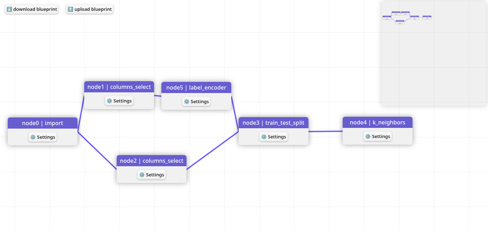

# 👋 Hi, I’m @AlexandreBoult
Here is a list of some of my projects : 
- [AutoML](https://github.com/data-IA-2023/AutoML-Gr4/tree/alexandre)
  AutoML is a learning project trying to make a webapp where people can process data and train some ML models. It's main inspiration is Dataiku DSS.
  
- [MoodMatrix](https://github.com/data-IA-2023/MoodMatrix)
- [Python fun](https://github.com/AlexandreBoult/Python-tests)
- [Webfloox](https://github.com/data-IA-2023/Groupe1_Webfloox)
- ...

<!---
AlexandreBoult/AlexandreBoult is a ✨ special ✨ repository because its `README.md` (this file) appears on your GitHub profile.
You can click the Preview link to take a look at your changes.
--->
